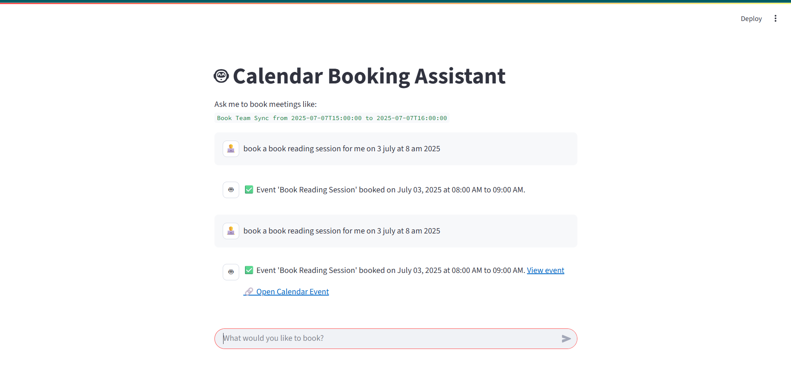

# 🗓️ Conversational Calendar Booking Assistant

This is a conversational AI bot that lets users book Google Calendar events using natural language. Built with **FastAPI**, **LangChain**, **Fireworks AI**, and optionally a **Streamlit frontend**.

---

## 🚀 Features

* 🔍 Understands natural language queries like *“Book meeting with Sam from 10 to 11 on July 8”*
* 🗖️ Books events into **Google Calendar** using the API
* 🧠 Uses **LangChain** with **Fireworks AI** (LLaMA 4 model) for intelligent reasoning
* 🌐 Built with **FastAPI** backend and optional **Streamlit** UI
* ✅ User-friendly confirmation messages with event links

---

## 💠 Tech Stack

| Layer          | Technology Used                   |
| -------------- | --------------------------------- |
| Backend        | FastAPI                           |
| Frontend (opt) | Streamlit                         |
| AI Reasoning   | LangChain + Fireworks AI          |
| Calendar API   | Google Calendar + Service Account |
| Environment    | Python 3.10+                      |

---

## 📦 Installation

```bash
git clone https://github.com/your-username/your-repo-name.git
cd your-repo-name

# (Recommended) Create virtual environment
python -m venv venv
source venv/bin/activate  # On Windows: venv\Scripts\activate

# Install dependencies
pip install -r requirements.txt
```

---

## 🧲 Environment Setup

Create a `.env` file in the root folder:

```env
FIREWORKS_API_KEY=your_fireworks_api_key
COHERE_API_KEY=your_cohere_key_if_any
GOOGLE_CALENDAR_ID=your_calendar_id_here
```

Add your `service_account.json` in the project root and ensure it has **calendar write access**.

---

## ▶️ Running the App

### Start FastAPI backend (booking API):

```bash
uvicorn main:app --reload
```

### Run Streamlit chatbot UI (optional):

```bash
streamlit run chat_ui.py
```

---

## 🧠 Tooling & Dependencies

* `fastapi` – backend framework
* `uvicorn` – ASGI server for FastAPI
* `python-dotenv` – loads environment variables
* `requests` – HTTP requests to backend
* `langchain`, `langchain-community`, `langchain-core` – agent logic
* `fireworks-ai` – LLM provider
* `google-api-python-client`, `google-auth`, `google-auth-httplib2`, `google-auth-oauthlib` – Google Calendar API
* `streamlit` – frontend UI
* `pydantic` – request validation for FastAPI

---

## ✅ Example Query

> 🗣️ “Book team sync from 2025-07-07T15:00:00 to 2025-07-07T16:00:00”

🗕️ Response:
`✅ Event 'team sync' booked on July 7, 2025 at 03:00 PM to 04:00 PM. [View event](https://calendar.google.com/event?...)`

---
## 🖼️ User Interface

Here’s how the chatbot UI looks in action:



---

## 📌 Notes

* The calendar integration uses a **service account**, meaning all events are added to the account’s calendar (not the end user's).
* You can switch to OAuth flow for per-user calendars in future versions.

---

## 🧑‍💻 Author

Built by \[Samruddhi Kulkarni]

---

## 📜 License

MIT License – feel free to use and modify!
